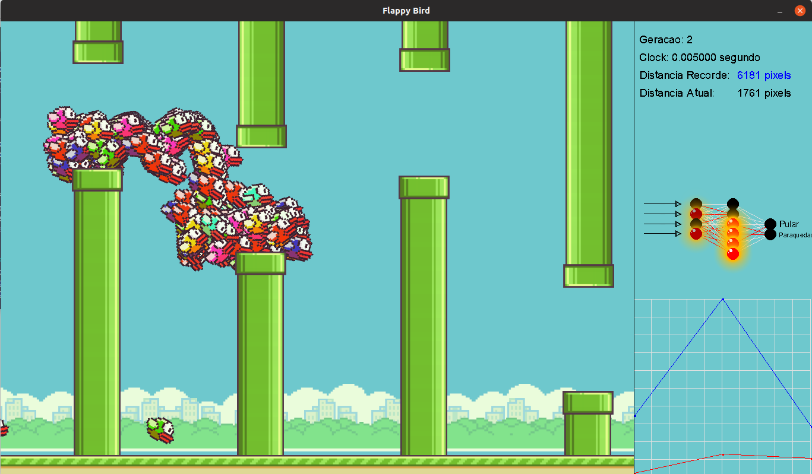
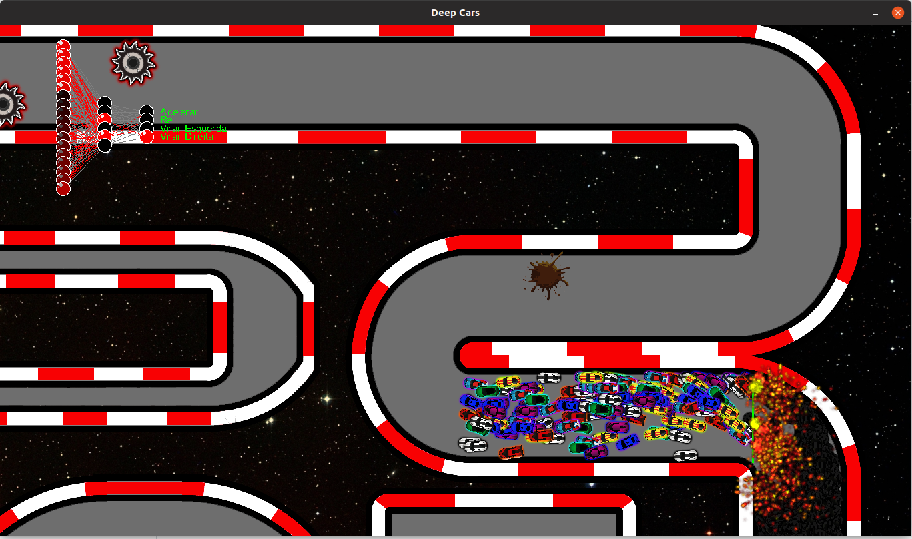
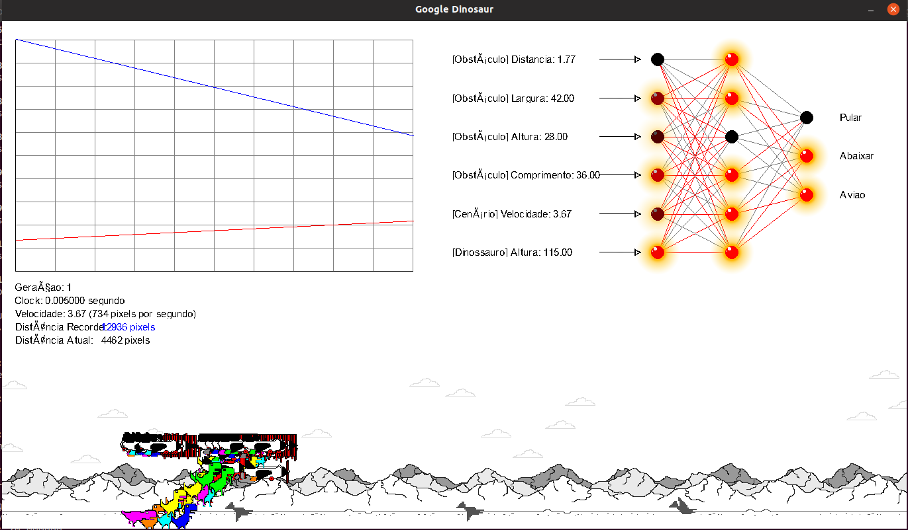
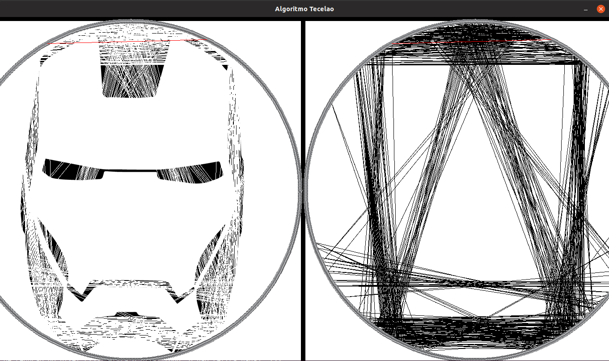

# Neural Network Training with Games

Adapted for Linux/Mac

Credits [JVictorDias](https://github.com/JVictorDias)

# Deps

* sdl2
* sdl2-ttf
* sdl2-image
* libwebp
* make
* g++/clang++

Linux
```sh
sudo apt install -y libsdl2-dev libsdl2-ttf-dev libsdl2-image-dev libwebp-dev libgsl-dev
```

Mac
```sh
sudo brew install sdl2 sdl2-ttf sdl2-image gsl
```

# How to test


## Flappy-Bird

```
make run-flappy
```


|key|Action|
|---|------|
|esc | Pause |
|space | info |


[Youtube](https://www.youtube.com/watch?v=vavXvu_SMeM)

## Deep-Cars

```
make run-cars
```



[Youtube](https://www.youtube.com/watch?v=gnfkfUQvKDw)


## Dinossauro

```
make run-dino
```




[Youtube](https://www.youtube.com/watch?v=NZlIYr1slAk)


## Tecelao

```
make run-tecelao
```

Parameters (input.txt)

```
Digite o nome da sua imagem (exemplo: teste.bmp): iron.bmp
Digite a quantidade de pregos (maximo 1000): 1000
Digite a quantidade de linhas: 1800
Digite a taxa de reducao do pixel (255 retira o pixel todo, 0 nao retira nada): 255
```
Left mouse click + ENTER to start


Commands

|key|Action|
|---|------|
|a  |Left  |
|d  |Right |
|w  |Up    |
|s  |Down  |
|q  |Zoom In|
|e  |Zoom Out|
|z  |ReDraw|
|ENTER|Start|




[Youtube](https://www.youtube.com/watch?v=YZtx4jNNbx8)

## ParticulasGravitacionais3D

```
make run-particulas
```

|key|Action|
|---|------|
|a  |Left  |
|d  |Right |
|w  |Up    |
|s  |Down  |
|q  |Zoom In|
|e  |Zoom Out|
|h  |Rotate Up X|
|y  |Rotate Down X|
|g  |Rotate Left Y|
|j  |Rotate Right Y|
|ENTER|Join particles|
|Mouse Left|Expand particles|


[Youtube](https://www.youtube.com/watch?v=rTZJtiCAmTI)


## Spirograph

```
make run-spirograph
```

|key|Action|
|---|------|
|ENTER  |Next  |


[Youtube](https://www.youtube.com/watch?v=o7MOaXh4zFU)


# Source

* [Spirograph](https://github.com/JVictorDias/Spirograph)

* [ParticulasGravitacionais3D](https://github.com/JVictorDias/ParticulasGravitacionais3D)

* [Dinossauro-Google](https://github.com/JVictorDias/Dinossauro-Google)

* [FlappIA-Bird](https://github.com/JVictorDias/FlappIA-Bird)

* [Depp-Cars](https://github.com/JVictorDias/DeepCars)

* [Algoritmo-Tecelao](https://github.com/JVictorDias/AlgoritmoTecelao)
