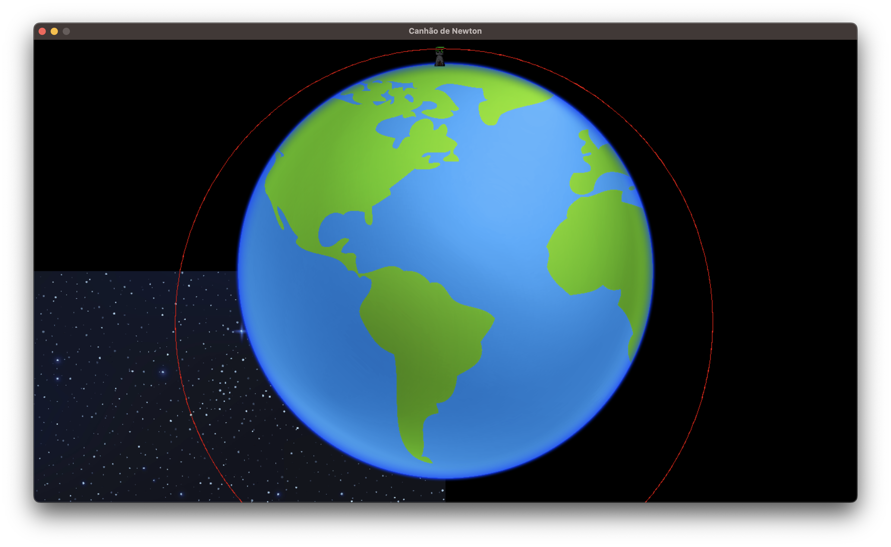

[](https://github.com/humbertodias/neural-network-training-with-games/actions/workflows/release.yml)

# Neural Network Training with Games

Adapted for Linux/Mac

Credits to [JVictorDias](https://github.com/JVictorDias) developer and [PIG](https://github.com/JoelsonFerreira/PigDev) library aka "Programming Interface for Games".

# How to run

Download the [release](https://github.com/humbertodias/neural-network-training-with-games/releases) zip file, unzip it and then run the main file.

or 

As a developer using an environment with all required dependencies installed as follow.

Linux
```shell
make linux-dep-install
```
Mac
```shell
make mac-dep-install
```
# Games

## Tecelao

```
make run-tecelao
```


Parameters (input.txt)

```
Digite o nome da sua imagem (exemplo: teste.bmp): iron.bmp
Digite a quantidade de pregos (maximo 1000): 1000
Digite a quantidade de linhas: 1800
Digite a taxa de reducao do pixel (255 retira o pixel todo, 0 nao retira nada): 255
```
Left mouse click + ENTER to start


Commands

|key|Action|
|---|------|
|a  |Left  |
|d  |Right |
|w  |Up    |
|s  |Down  |
|q  |Zoom In|
|e  |Zoom Out|
|z  |ReDraw|
|ENTER|Start|


[Youtube](https://www.youtube.com/watch?v=YZtx4jNNbx8) | [Source](https://github.com/JVictorDias/AlgoritmoTecelao)

## Canhao de Newton

```shell
make run-canhao
```



|key|Action|
|---|------|
|ENTER  |Atirar |
|a/s/d/w  |esq/dir/cima/baixo |


[Youtube](https://www.youtube.com/watch?v=evcnQajrR6E) | [Source](https://github.com/JVictorDias/CanhaoDeNewton)

## Deep-Cars

```shell
make run-cars
```


[Youtube](https://www.youtube.com/watch?v=gnfkfUQvKDw) | [Source](https://github.com/JVictorDias/DeepCars)

## Dinossauro

```shell
make run-dino
```


[Youtube](https://www.youtube.com/watch?v=NZlIYr1slAk) | [Source](https://github.com/JVictorDias/Dinossauro-Google)


## Flappy-Bird

```shell
make run-flappy
```


|key|Action|
|---|------|
|esc | Pause |
|space | info |


[Youtube](https://www.youtube.com/watch?v=vavXvu_SMeM) | [Source](https://github.com/JVictorDias/FlappIA-Bird)


## HardestGame

```shell
make run-hardestgame
```


|key|Action|
|---|------|
|F2  |Load next map |
|ENTER  |Start map  |

[Youtube](https://www.youtube.com/watch?v=QD-gHp81G4M) | [Source](https://github.com/JVictorDias/HardestGame)


## HardestGameEditor

```shell
make run-hardestgame-editor
```


|key|Action|
|---|------|
|d/f  |Angulo de troca |
|cima/baixo  |Tamanho grade  |
|j/k  |Tempo parado |
|g/h  |Angulo parada |
|i  |Salvar posicao mouse |
|u  |Carregar posicao salva  |
|F1 |Salvar mapa  |
|F2  |Carregar mapa  |

[Source](https://github.com/JVictorDias/HardestGameEditor)


## ParticulasGravitacionais3D

```shell
make run-particulas
```


|key|Action|
|---|------|
|a  |Left  |
|d  |Right |
|w  |Up    |
|s  |Down  |
|q  |Zoom In|
|e  |Zoom Out|
|h  |Rotate Up X|
|y  |Rotate Down X|
|g  |Rotate Left Y|
|j  |Rotate Right Y|
|ENTER|Join particles|
|Mouse Left|Expand particles|


[Youtube](https://www.youtube.com/watch?v=rTZJtiCAmTI) | [Source](https://github.com/JVictorDias/ParticulasGravitacionais3D)


## Spirograph

```shell
make run-spirograph
```


|key|Action|
|---|------|
|ENTER  |Next  |


[Youtube](https://www.youtube.com/watch?v=o7MOaXh4zFU) | [Source](https://github.com/JVictorDias/Spirograph)
